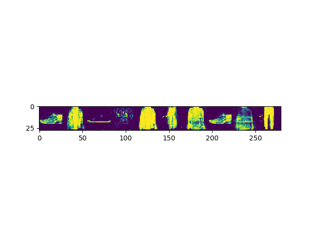

# Relativistic GAN

## What is it?

This repo has a simple implementation of a relativistic GAN.
A relativistic modifies the GAN objective to substantially improve training stability.

The two objectives are:

 - For the generator training step:
    ```
    err_d = (
                torch.mean((y_real - torch.mean(y_gene) - 1) ** 2) +
                torch.mean((y_gene - torch.mean(y_real) + 1) ** 2)
        )
    ```
    Where `y_real` is the *discriminator* score of the *real* data and `y_gene` is the 
    *discriminator* score of *fake* data
 - For the discriminator:
    ```
    err_g = (
                torch.mean((y_real - torch.mean(y_gene) + 1) ** 2) +
                torch.mean((y_gene - torch.mean(y_real) - 1) ** 2)
        )
    ```
    
## Running it

This should work:

```
# Install pytorch (0.4.0 or higher), sacred, torchvision, various numeric libs
$ PYTHONPATH=. python -m relgan
```

As it runs it will output samples every 100 training steps into the "runs" folder.

## Code tour

 - `__main__.py` - the entry point for execution, runs through sacred.
 - `__init__.py` - the main file.
 - `networks.py` - defines the generator and discriminator networks.
 - `trainer.py` - defines the GAN trainer. 
 - `utils.py` - useful stuff
 
If you're interested in GANs, you probably want to look at `trainer.py`, as it 
contains the code that trains the system. the `step` function simply calls
the step functions for the generator & discriminator in turn.

If you want to make your own GAN, you probably want to look at:

 - `networks.py` - modify the architecture to match the data you generate
 - `__init__.py` - modify the data loading to load your data. All you need to do 
   is to pass the right data to trainer.RelGAN.


## Sample:
Training on FashionMNIST, using code at git commit `72a8aa36035559b1e70cc621b058cca9dc36e02f`:

 